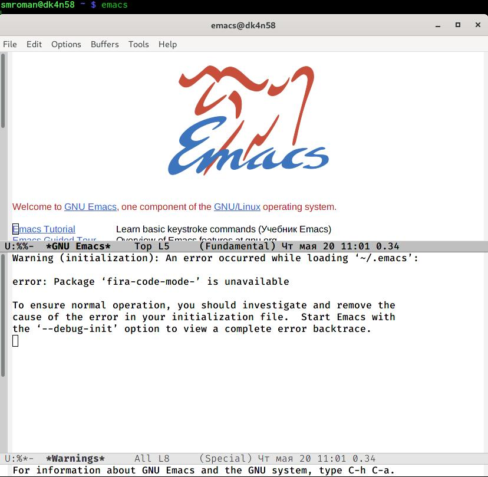
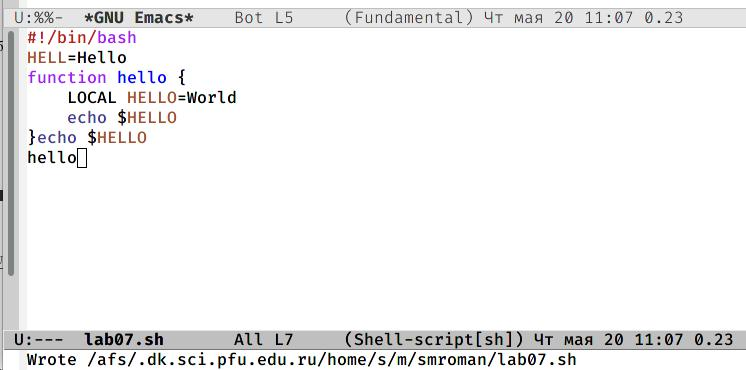
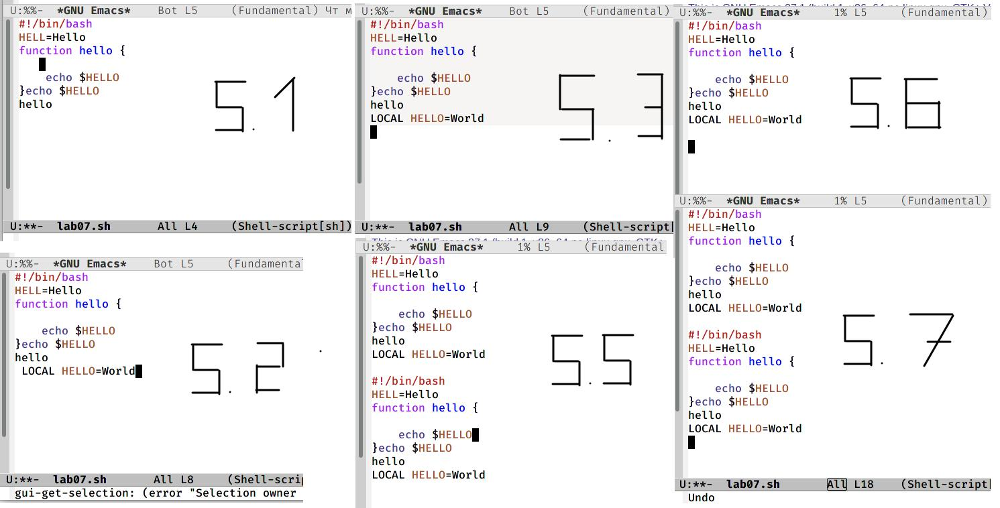
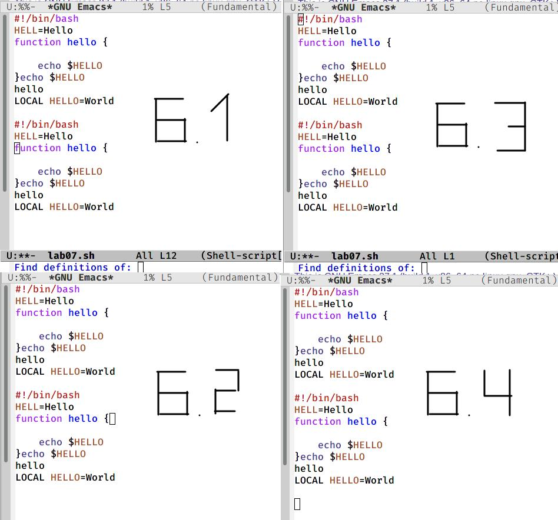
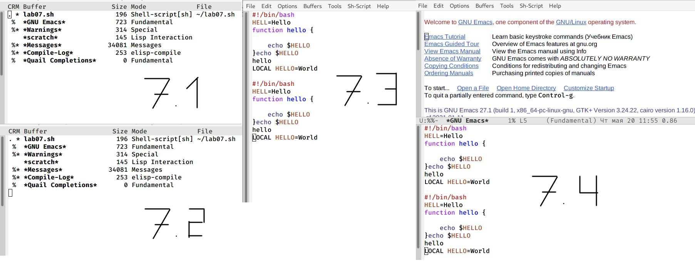
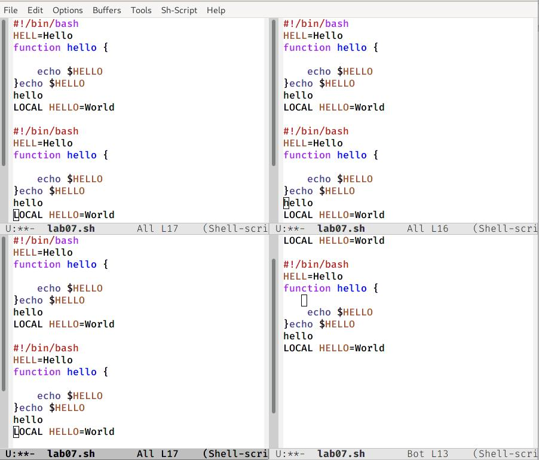
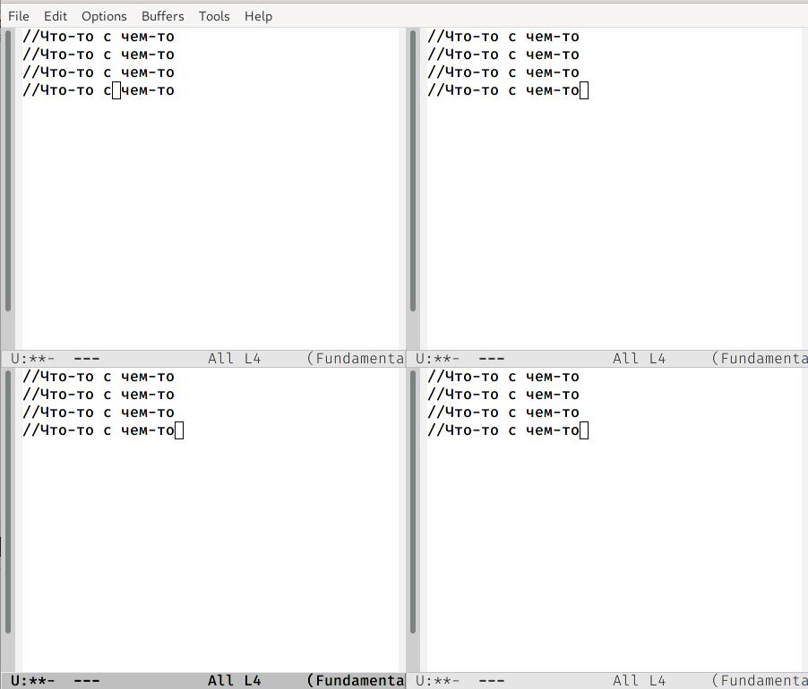
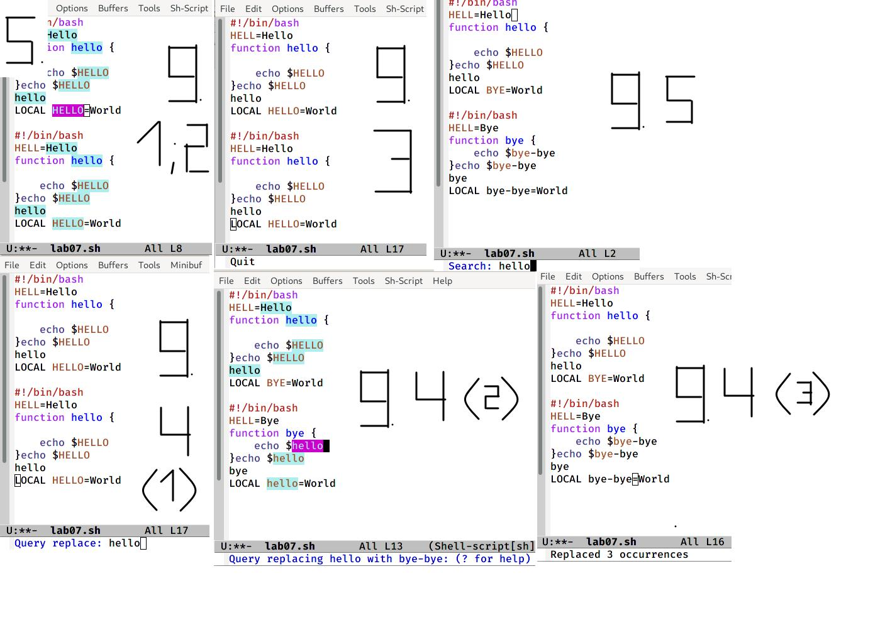

---
# Front matter
lang: ru-RU
title: "Лабораторная работа №10"
subtitle: "Текстовой редактор emacs"
author: "Сергей Михайлович Роман"

# Formatting
toc-title: "Содержание"
toc: true # Table of contents
toc_depth: 2
lof: true # List of figures
lot: true # List of tables
fontsize: 12pt
linestretch: 1.5
papersize: a4paper
documentclass: scrreprt
polyglossia-lang: russian
polyglossia-otherlangs: english
mainfont: PT Serif
romanfont: PT Serif
sansfont: PT Sans
monofont: PT Mono
mainfontoptions: Ligatures=TeX
romanfontoptions: Ligatures=TeX
sansfontoptions: Ligatures=TeX,Scale=MatchLowercase
monofontoptions: Scale=MatchLowercase
indent: true
pdf-engine: lualatex
header-includes:
  - \linepenalty=10 # the penalty added to the badness of each line within a paragraph (no associated penalty node) Increasing the value makes tex try to have fewer lines in the paragraph.
  - \interlinepenalty=0 # value of the penalty (node) added after each line of a paragraph.
  - \hyphenpenalty=50 # the penalty for line breaking at an automatically inserted hyphen
  - \exhyphenpenalty=50 # the penalty for line breaking at an explicit hyphen
  - \binoppenalty=700 # the penalty for breaking a line at a binary operator
  - \relpenalty=500 # the penalty for breaking a line at a relation
  - \clubpenalty=150 # extra penalty for breaking after first line of a paragraph
  - \widowpenalty=150 # extra penalty for breaking before last line of a paragraph
  - \displaywidowpenalty=50 # extra penalty for breaking before last line before a display math
  - \brokenpenalty=100 # extra penalty for page breaking after a hyphenated line
  - \predisplaypenalty=10000 # penalty for breaking before a display
  - \postdisplaypenalty=0 # penalty for breaking after a display
  - \floatingpenalty = 20000 # penalty for splitting an insertion (can only be split footnote in standard LaTeX)
  - \raggedbottom # or \flushbottom
  - \usepackage{float} # keep figures where there are in the text
  - \floatplacement{figure}{H} # keep figures where there are in the text
---

# Цель работы

Познакомиться с операционной системой Linux. Получить практические навыки работы с редактором Emacs.

# Задание

- 1. Ознакомиться с теоретическим материалом.
- 2. Ознакомиться с редактором emacs.
- 3. Выполнить упражнения.
- 4. Ответить на контрольные вопросы.

- 1. Открыть emacs.
- 2. Создать файл lab07.sh с помощью комбинации Ctrl-x Ctrl-f (C-x C-f).
- 3. Наберите текст: #!/bin/bash HELL = Hello function hello { LOCAL HELLO=World echo $HELLO} echo $HELLO hello
- 4. Сохранить файл с помощью комбинации Ctrl-x Ctrl-s (C-x C-s).
- 5. Проделать с текстом стандартные процедуры редактирования, каждое действие должно осуществляться комбинацией клавиш.
	- 5.1. Вырезать одной командой целую строку (С-k).
	- 5.2. Вставить эту строку в конец файла (C-y).
	- 5.3. Выделить область текста (C-space).
	- 5.4. Скопировать область в буфер обмена (M-w).
	- 5.5. Вставить область в конец файла.
	- 5.6. Вновь выделить эту область и на этот раз вырезать её (C-w).
	- 5.7. Отмените последнее действие (C-/). 
- 6. Научитесь использовать команды по перемещению курсора.
	- 6.1. Переместите курсор в начало строки (C-a).
	- 6.2. Переместите курсор в конец строки (C-e).
	- 6.3. Переместите курсор в начало буфера (M-<).
	- 6.4. Переместите курсор в конец буфера (M->).
- 7. Управление буферами.
	- 7.1. Вывести список активных буферов на экран (C-x C-b).
	- 7.2. Переместитесь во вновь открытое окно (C-x) o со списком открытых буферов и переключитесь на другой 		буфер.
	- 7.3. Закройте это окно (C-x 0).
	- 7.4. Теперь вновь переключайтесь между буферами, но уже без вывода их списка на экран (C-x b).
- 8. Управление окнами. 
	- 8.1. Поделите фрейм на 4 части: разделите фрейм на два окна по вертикали (C-x 3), а затем каждое из этих окон на две части по горизонтали (C-x 2).
	-8.2. В каждом из четырёх созданных окон откройте новый буфер (файл) и введите несколько строк текста.
- 9. Режим поиска
	- 9.1. Переключитесь в режим поиска (C-s) и найдите несколько слов, присутствующих в тексте.
	- 9.2. Переключайтесь между результатами поиска, нажимая C-s. 
	- 9.3. Выйдите из режима поиска, нажав C-g.
	- 9.4. Перейдите в режим поиска и замены (M-%), введите текст, который следует найти и заменить, нажмите 		Enter, затем введите текст для замены. После того как будут подсвечены результаты поиска, нажмите ! для 	подтверждения замены. 
	- 9.5. Испробуйте другой режим поиска, нажав M-s o. Объясните, чем он отличается от обычного режима?

# Выполнение лабораторной работы

1. Прочитав материалы к лабораторной работе, приступаю к её выполнению. Создаю файл с именем lab07.sh с помощью комбинации Ctrl-x Ctrl-f, после чего открываю его в emacs(рис. - @fig:001):

{ #fig:001 width=100% }

2. Записываю в файл необходимый текст, после чего сохраняю его.(рис. - @fig:003):

{ #fig:003 width=100% }

3. Проделываю все изменения описанные в пункте номер 5(рис. - @fig:004):

{ #fig:004 width=100% } 

4. Практикуюсь в перемещении курсора с помощью команд(рис. - @fig:005): 

{ #fig:005 width=100% }

5. Выполняю пункт 7, по управлению буферами(рис. - @fig:006):

{ #fig:006 width=100% } 

6. Разделяю фрейм на четыре части(рис. - @fig:007):

{ #fig:007 width=100% }

7. В каждой из частей записываю какой-то текст(рис. - @fig:008):

{ #fig:008 width=100% }

8. Изучаю режим поиска, переключаясь между режимами, заменя части текста. Отличие режима поиска M-s o от другого в том, что в этом случае курсор переводится на конец найденного слова(рис. - @fig:009):

{ #fig:009 width=100% }

# Выводы

Сегодня я познакомился с редактором emacs, поработал с фреймами, различными режимами и поэтому хорошо освоил данный редактор. 
