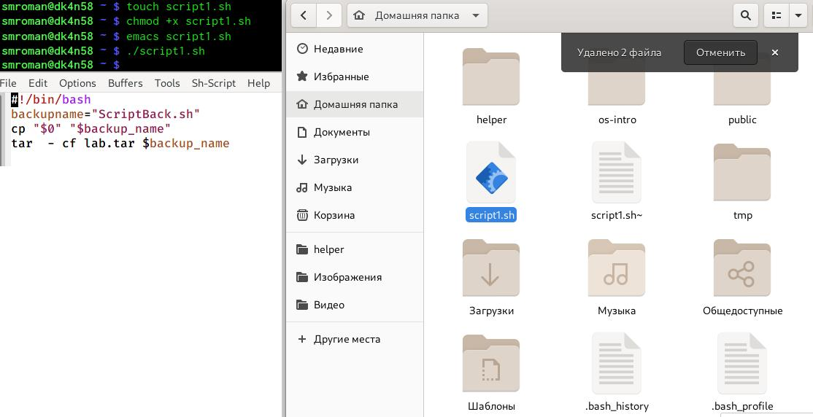
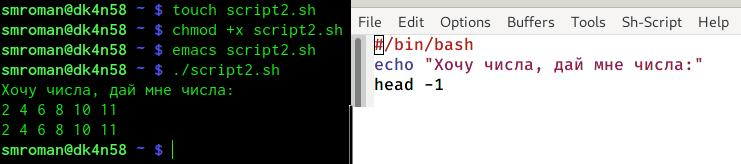
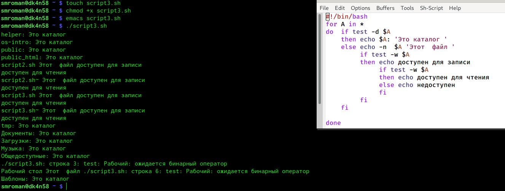
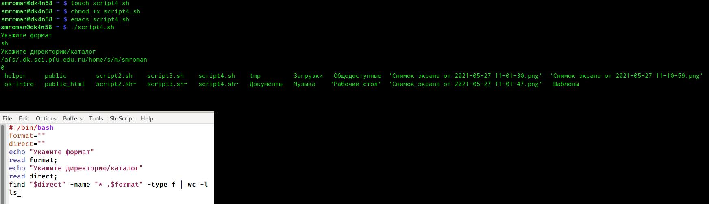

---
# Front matter
lang: ru-RU
title: "Лабораторная работа №11"
subtitle: "Программирование в командномпроцессоре ОС UNIX. Командные файлы"
author: "Сергей Михайлович Роман"

# Formatting
toc-title: "Содержание"
toc: true # Table of contents
toc_depth: 2
lof: true # List of figures
lot: true # List of tables
fontsize: 12pt
linestretch: 1.5
papersize: a4paper
documentclass: scrreprt
polyglossia-lang: russian
polyglossia-otherlangs: english
mainfont: PT Serif
romanfont: PT Serif
sansfont: PT Sans
monofont: PT Mono
mainfontoptions: Ligatures=TeX
romanfontoptions: Ligatures=TeX
sansfontoptions: Ligatures=TeX,Scale=MatchLowercase
monofontoptions: Scale=MatchLowercase
indent: true
pdf-engine: lualatex
header-includes:
  - \linepenalty=10 # the penalty added to the badness of each line within a paragraph (no associated penalty node) Increasing the value makes tex try to have fewer lines in the paragraph.
  - \interlinepenalty=0 # value of the penalty (node) added after each line of a paragraph.
  - \hyphenpenalty=50 # the penalty for line breaking at an automatically inserted hyphen
  - \exhyphenpenalty=50 # the penalty for line breaking at an explicit hyphen
  - \binoppenalty=700 # the penalty for breaking a line at a binary operator
  - \relpenalty=500 # the penalty for breaking a line at a relation
  - \clubpenalty=150 # extra penalty for breaking after first line of a paragraph
  - \widowpenalty=150 # extra penalty for breaking before last line of a paragraph
  - \displaywidowpenalty=50 # extra penalty for breaking before last line before a display math
  - \brokenpenalty=100 # extra penalty for page breaking after a hyphenated line
  - \predisplaypenalty=10000 # penalty for breaking before a display
  - \postdisplaypenalty=0 # penalty for breaking after a display
  - \floatingpenalty = 20000 # penalty for splitting an insertion (can only be split footnote in standard LaTeX)
  - \raggedbottom # or \flushbottom
  - \usepackage{float} # keep figures where there are in the text
  - \floatplacement{figure}{H} # keep figures where there are in the text
---

# Цель работы

Изучить основы программирования в оболочке ОС UNIX/Linux. Научиться писать небольшие командные файлы.

# Задание

- 1. Написать скрипт, который при запуске будет делать резервную копию самого себя (то есть файла, в котором 	  содержится его исходный код) в другую директорию backup в вашем домашнем каталоге. При этом файл должен архивироваться одним из архиваторов на выбор zip, bzip2 или tar. Способ использования команд архивации необходимо узнать, изучив справку.
- 2. Написать пример командного файла, обрабатывающего любое произвольное число аргументов командной строки, в том числе превышающее десять. Например, скрипт может последовательно распечатывать значения всех переданных аргументов.
- 3. Написать командный файл — аналог команды ls (без использования самой этой команды и команды dir). Требуется, чтобы он выдавал информацию о нужном каталоге и выводил информацию о возможностях доступа к файлам этого каталога.
- 4. Написать командный файл, который получает в качестве аргумента командной строки формат файла (.txt, .doc, .jpg, .pdf и т.д.) и вычисляет количество таких файлов в указанной директории. Путь к директории также передаётся в виде аргумента командной строки.

# Выполнение лабораторной работы

1. Прочитав справку об архиваторе tar, начинаю выполнение первого задания. Создаю файл script1.sh и даю ему возможность выполняться. Открываю этот файл в emacs и пишу в нём скрипт. Закрываю и выполняю. (рис. - @fig:001):

{ #fig:001 width=100% }

2. Выполняю задание номер 2. Создаю новый файл script2.sh и даю ему возможность выполняться. Открываю этот файл в emacs и пишу в нём скрипт. Закрываю, выполняю, вписав числа в консоль.(рис. - @fig:002):

{ #fig:002 width=100% }

3. Выполняю задание номер 3. Создаю новый файл script3.sh и даю ему возможность выполняться. Открываю этот файл в emacs и пишу в нём скрипт. Закрываю и выполняю.(рис. - @fig:003):

{ #fig:003 width=100% } 

4. Выполняю задание номер 4. Создаю новый файл script4.sh и даю ему возможность выполняться. Открываю этот файл в emacs и пишу в нём скрипт. Закрываю и выполняю, вводя формат файла и директорию, где искать.(рис. - @fig:004): 

{ #fig:004 width=100% }

# Выводы

Сегодня я изучил основы программирования в оболочке ОС UNIX и научился писать небольшие программы. 
