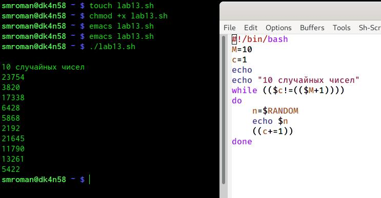
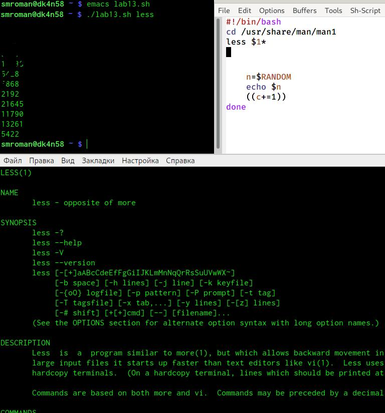
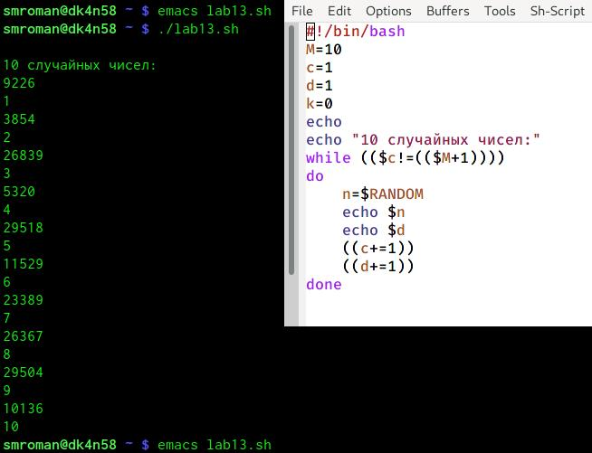

---
# Front matter
lang: ru-RU
title: "Лабораторная работа №13"
subtitle: "Программирование в командномпроцессоре ОС UNIX."
author: "Сергей Михайлович Роман"

# Formatting
toc-title: "Содержание"
toc: true # Table of contents
toc_depth: 2
lof: true # List of figures
lot: true # List of tables
fontsize: 12pt
linestretch: 1.5
papersize: a4paper
documentclass: scrreprt
polyglossia-lang: russian
polyglossia-otherlangs: english
mainfont: PT Serif
romanfont: PT Serif
sansfont: PT Sans
monofont: PT Mono
mainfontoptions: Ligatures=TeX
romanfontoptions: Ligatures=TeX
sansfontoptions: Ligatures=TeX,Scale=MatchLowercase
monofontoptions: Scale=MatchLowercase
indent: true
pdf-engine: lualatex
header-includes:
  - \linepenalty=10 # the penalty added to the badness of each line within a paragraph (no associated penalty node) Increasing the value makes tex try to have fewer lines in the paragraph.
  - \interlinepenalty=0 # value of the penalty (node) added after each line of a paragraph.
  - \hyphenpenalty=50 # the penalty for line breaking at an automatically inserted hyphen
  - \exhyphenpenalty=50 # the penalty for line breaking at an explicit hyphen
  - \binoppenalty=700 # the penalty for breaking a line at a binary operator
  - \relpenalty=500 # the penalty for breaking a line at a relation
  - \clubpenalty=150 # extra penalty for breaking after first line of a paragraph
  - \widowpenalty=150 # extra penalty for breaking before last line of a paragraph
  - \displaywidowpenalty=50 # extra penalty for breaking before last line before a display math
  - \brokenpenalty=100 # extra penalty for page breaking after a hyphenated line
  - \predisplaypenalty=10000 # penalty for breaking before a display
  - \postdisplaypenalty=0 # penalty for breaking after a display
  - \floatingpenalty = 20000 # penalty for splitting an insertion (can only be split footnote in standard LaTeX)
  - \raggedbottom # or \flushbottom
  - \usepackage{float} # keep figures where there are in the text
  - \floatplacement{figure}{H} # keep figures where there are in the text
---

# Цель работы

Изучить основы программирования в оболочке ОС UNIX. Научится писать более сложные командные файлы с использованием логических управляющих конструкций и циклов.

# Задание

- 1.Осуществить вход в систему, создать текстовый документ, затем перейти в него. Написали файл, реализующий упрощенный механизм семафоров. Командный файл должен в течение некоторого времени t1 дожидаться освобождения ресурса, выдавая об этом сообщение, а дождавшись его освобождения использовать его в течение некоторого времени t2<>t1, также выдавая информацию о том, что ресурс используется соответствующим командным файлом. Запустили командный файл в одном виртуальном терминале в фоновом режиме, перенаправив его вывод в другой, в котором также запущен этот файл, но не фоновом, а в привилегированном режиме.
- 2. Реализовали команду man с помощью командного файла. Изучили содержимое каталога /usr/share/man/man1. В нем находятся архивы текстовых файлов содержащих справку по большинству установленных в системе программ и команд. Каждый архив можно открыть командой less сразу же просмотрев содержимое справки. Командный файл должен получать в виде аргумента командной строки название команды и в виде результата выдавать справку об этой команде или сообщение об отсутствии справки, если соответствующего файла нет в каталоге man1.
- 3. Используя встроенную переменную $RANDOM написали командный файл, генерирующий случайную последовательность букв латинского алфавита. Учтём, что $RANDOM выдает псевдослучайные числа в диапазоне от 0 до 32767. 

# Выполнение лабораторной работы

1. Осуществив вход в систему, создаю текстовый документ, затем перехожу в него. Пишу файл, реализующий задачу из задания 1.(рис. - @fig:001):

{ #fig:001 width=100% }

2. Реализую команду man с помощью командного файла - Задание 2.(рис. - @fig:002):

{ #fig:002 width=100% }

3. Используя встроенную переменную $RANDOM пишк командный файл, генерирующий случайную последовательность букв латинского алфавита.(рис. - @fig:003):

{ #fig:003 width=100% } 

#Вывод:

Я изучил основы программирования в оболочке ОС UNIX. Научилися писать более сложные командные файлы с использованием логических управляющих конструкций и циклов.

# Выводы

Сегодня я изучил основы программирования в оболочке ОС UNIX и научился писать небольшие программы. 
