---
# Front matter
lang: ru-RU
title: "Отчёта по лабораторной работе №5"
subtitle: "Основы интерфейсавзаимодействия пользователя с системой Unix на уровнекомандной строки"
author: "Сергей Михайлович Роман"

# Formatting
toc-title: "Содержание"
toc: true # Table of contents
toc_depth: 2
lof: true # List of figures
lot: true # List of tables
fontsize: 12pt
linestretch: 1.5
papersize: a4paper
documentclass: scrreprt
polyglossia-lang: russian
polyglossia-otherlangs: english
mainfont: PT Serif
romanfont: PT Serif
sansfont: PT Sans
monofont: PT Mono
mainfontoptions: Ligatures=TeX
romanfontoptions: Ligatures=TeX
sansfontoptions: Ligatures=TeX,Scale=MatchLowercase
monofontoptions: Scale=MatchLowercase
indent: true
pdf-engine: lualatex
header-includes:
  - \linepenalty=10 # the penalty added to the badness of each line within a paragraph (no associated penalty node) Increasing the value makes tex try to have fewer lines in the paragraph.
  - \interlinepenalty=0 # value of the penalty (node) added after each line of a paragraph.
  - \hyphenpenalty=50 # the penalty for line breaking at an automatically inserted hyphen
  - \exhyphenpenalty=50 # the penalty for line breaking at an explicit hyphen
  - \binoppenalty=700 # the penalty for breaking a line at a binary operator
  - \relpenalty=500 # the penalty for breaking a line at a relation
  - \clubpenalty=150 # extra penalty for breaking after first line of a paragraph
  - \widowpenalty=150 # extra penalty for breaking before last line of a paragraph
  - \displaywidowpenalty=50 # extra penalty for breaking before last line before a display math
  - \brokenpenalty=100 # extra penalty for page breaking after a hyphenated line
  - \predisplaypenalty=10000 # penalty for breaking before a display
  - \postdisplaypenalty=0 # penalty for breaking after a display
  - \floatingpenalty = 20000 # penalty for splitting an insertion (can only be split footnote in standard LaTeX)
  - \raggedbottom # or \flushbottom
  - \usepackage{float} # keep figures where there are in the text
  - \floatplacement{figure}{H} # keep figures where there are in the text
---

# Цель работы

Приобретение практических навыков взаимодействия пользователя с системой посредством командной строки.

# Задание

- 1.Определите полное имя вашего домашнего каталога. Далее относительно этого каталога будут выполняться последующие упражнения.
- 2.Выполните следующие действия:
	- 2.1.Перейдите в каталог /tmp.
	- 2.2.Выведите на экран содержимое каталога /tmp. Для этого используйте команду ls с различными опциями. Поясните разницу в выводимой на экран информации.
	- 2.3.Определите, есть ли в каталоге /var/spool подкаталог с именем cron?
	- 2.4.Перейдите в Ваш домашний каталог и выведите на экран его содержимое. Определите, кто является владельцем файлов и подкаталогов?
- 3.Выполните следующие действия:
	- 3.1.В домашнем каталоге создайте новый каталог с именем newdir.
	- 3.2.В каталоге ~/newdir создайте новый каталог с именем morefun.
	- 3.3.В домашнем каталоге создайте одной командой три новых каталога с именами letters, memos, misk. Затем удалите эти каталоги одной командой.
	- 3.4.Попробуйте удалить ранее созданный каталог ~/newdir командой rm. Проверьте, был ли каталог удалён.
	- 3.5.Удалите каталог ~/newdir/morefun из домашнего каталога. Проверьте,был ли каталог удалён.
- 4.С помощью команды man определите, какую опцию команды ls нужно использовать для просмотра содержимое не только указанного каталога, но и подкаталогов, входящих в него.
- 5.С помощью команды man определите набор опций команды ls, позволяющий отсортировать по времени последнего изменения выводимый список содержимого каталога с развёрнутым описанием файлов.
- 6.Используйте команду man для просмотра описания следующих команд: cd, pwd, mkdir, rmdir, rm. Поясните основные опции этих команд.
- 7.Используя информацию, полученную при помощи команды history, выполните модификацию и исполнение нескольких команд из буфера команд.

# Выполнение лабораторной работы

1. Ввожу команду pwd, чтобы получить полное имя домашнего каталога(рис. - @fig:002):

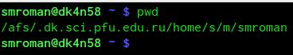{ #fig:002 width=100% }

2. Перехожу в каталог /tmp и вывожу его содержимое командой ls, сначала без опции, потом с опцией -a(рис. - @fig:003),(рис. - @fig:004),(рис. - @fig:005):

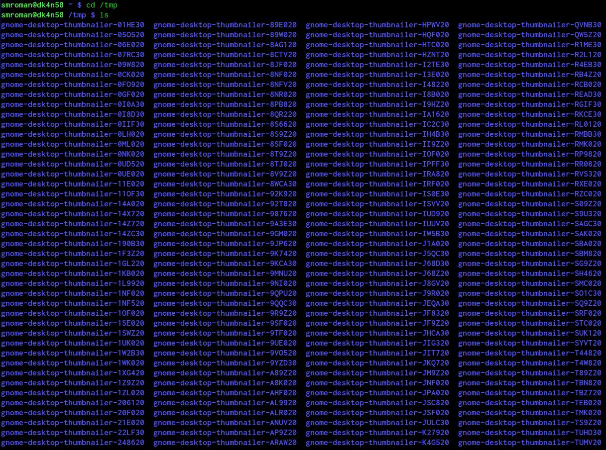{ #fig:003 width=70% }
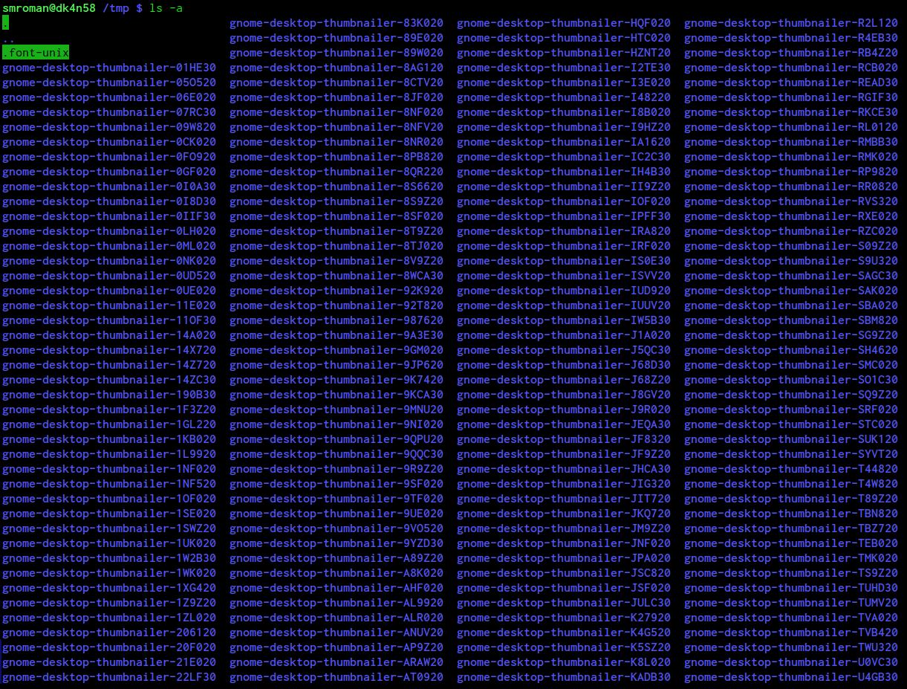{ #fig:004 width=70% }
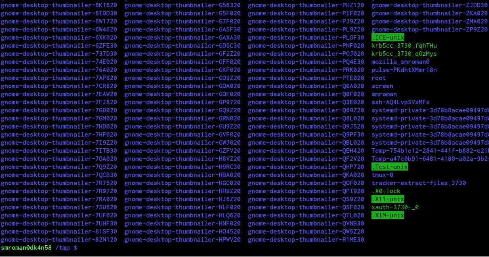{ #fig:005 width=70% }

Отличие вывода с опцией -а заключается в том, что с ней нам выведутся также скрытые файлы.

3. Определяю, есть ли в каталоге /var/spool каталог cron. Да, есть(рис. - @fig:006):

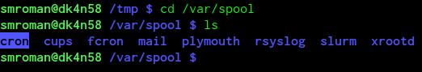{ #fig:006 width=100% }

4. Выясняю, кто является владельцем файлов в моём домашнем каталоге. В итоге владелец - **studsci**(рис. - @fig:007):

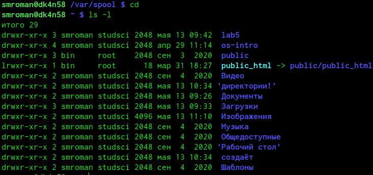{ #fig:007 width=70% }

5. В домашнем каталоге создаю каталог newdir, в нём потом создаю каталог morefun(рис. - @fig:008):

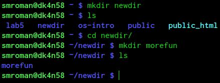{ #fig:008 width=100% }

6. Теперь в домашнем каталоге создаю три новых каталога letters, memos, misk одной командой, после чего удаляю их тоже одной командой(рис. - @fig:009):

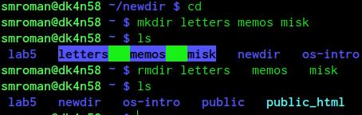{ #fig:009 width=100% }

7. Пробую удалить ранее созданный каталог ~/newdir командой rm. Неудачно. После чего удаляю правильно каталог /newdir/morefun из домашнего каталога(рис. - @fig:010):

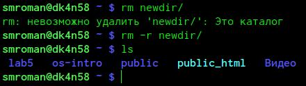{ #fig:010 width=100% }

8. С помощью команды man определяю, какую опцию команды ls нужно использовать для просмотра содержимого не только указанного каталога, но и подкаталогов, входящих в него. С помощью команды man определяю набор опций команды ls, позволяющий отсортировать по времени последнего изменения выводимый список содержимого каталога с развёрнутым описанием файлов. Использую команду man для просмотра описания следующих команд: cd, pwd, mkdir, rmdir, rm.(рис. - @fig:011):

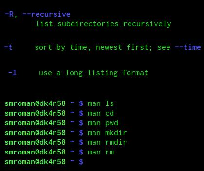{ #fig:011 width=70% }

- -R - опция, выводящая подкаталоги, входящие в каталог.
- -t -l - набор опций отсортировывающий по времени + расширенный вывод.

- cd - перемещает пользователя по директориям.
- pwd - показывает полное имя(путь) каталога, в котором применена команда.
- mkdir - создаёт каталог.
- rmdir - удаляет пустые каталоги.
- rm - удаляет файлы(при нужной опции также может удалить каталог).

9. Выполняю команду history  после чего добавляю к ней опции, выполняю несколько команд из списка(рис. - @fig:012):

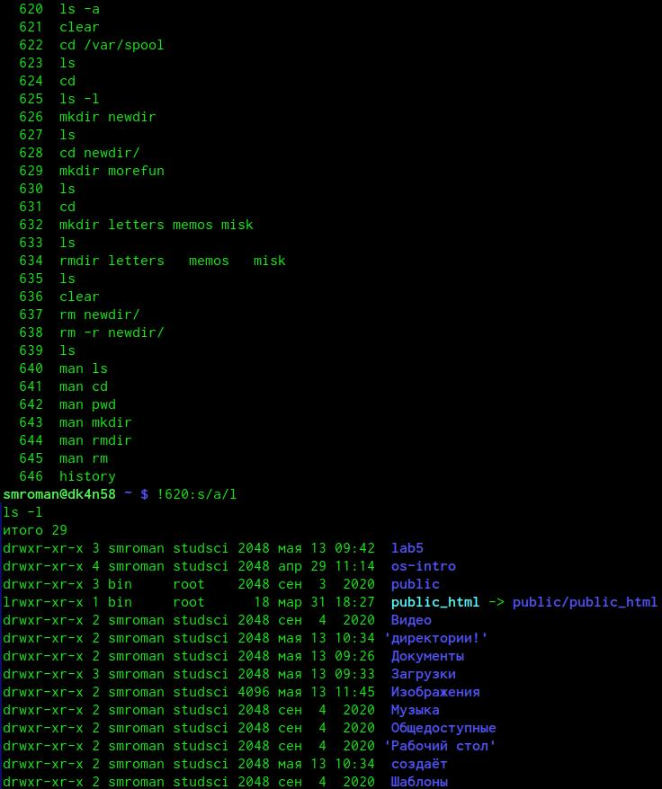{ #fig:012 width=70% }

# Выводы

Сегодня я приобрёл практический навык взаимодействия с системой посредством командной строки.
