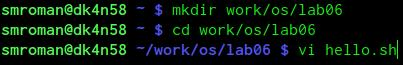
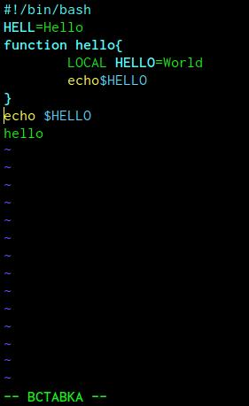
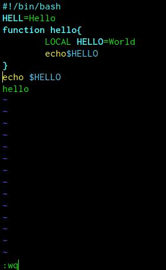
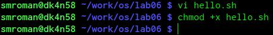
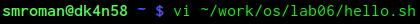
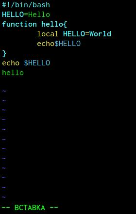

---
# Front matter
lang: ru-RU
title: "Лабораторная работа №9"
subtitle: "Текстовой редактор vi"
author: "Сергей Михайлович Роман"

# Formatting
toc-title: "Содержание"
toc: true # Table of contents
toc_depth: 2
lof: true # List of figures
lot: true # List of tables
fontsize: 12pt
linestretch: 1.5
papersize: a4paper
documentclass: scrreprt
polyglossia-lang: russian
polyglossia-otherlangs: english
mainfont: PT Serif
romanfont: PT Serif
sansfont: PT Sans
monofont: PT Mono
mainfontoptions: Ligatures=TeX
romanfontoptions: Ligatures=TeX
sansfontoptions: Ligatures=TeX,Scale=MatchLowercase
monofontoptions: Scale=MatchLowercase
indent: true
pdf-engine: lualatex
header-includes:
  - \linepenalty=10 # the penalty added to the badness of each line within a paragraph (no associated penalty node) Increasing the value makes tex try to have fewer lines in the paragraph.
  - \interlinepenalty=0 # value of the penalty (node) added after each line of a paragraph.
  - \hyphenpenalty=50 # the penalty for line breaking at an automatically inserted hyphen
  - \exhyphenpenalty=50 # the penalty for line breaking at an explicit hyphen
  - \binoppenalty=700 # the penalty for breaking a line at a binary operator
  - \relpenalty=500 # the penalty for breaking a line at a relation
  - \clubpenalty=150 # extra penalty for breaking after first line of a paragraph
  - \widowpenalty=150 # extra penalty for breaking before last line of a paragraph
  - \displaywidowpenalty=50 # extra penalty for breaking before last line before a display math
  - \brokenpenalty=100 # extra penalty for page breaking after a hyphenated line
  - \predisplaypenalty=10000 # penalty for breaking before a display
  - \postdisplaypenalty=0 # penalty for breaking after a display
  - \floatingpenalty = 20000 # penalty for splitting an insertion (can only be split footnote in standard LaTeX)
  - \raggedbottom # or \flushbottom
  - \usepackage{float} # keep figures where there are in the text
  - \floatplacement{figure}{H} # keep figures where there are in the text
---

# Цель работы

Познакомиться с операционной системой Linux. Получить практические навыки работы с редактором vi, установленным по умолчанию практически во всех дистрибутивах.

# Задание

- 1.Ознакомиться с теоретическим материалом.
- 2.Ознакомиться с редактором vi.
- 3.Выполнить упражнения, используя команды vi.

Задание 1:

1. Создайте каталог с именем ~/work/os/lab06.
2. Перейдите во вновь созданный каталог.
3. Вызовите vi и создайте файл hello.sh
	vi hello.sh
4. Нажмите клавишу i и вводите следующий текст.
#!/bin/bash
HELL=Hello
function hello {
	LOCAL HELLO=World 
	echo $HELLO
	}
echo $HELLO 
hello
5. Нажмитеклавишу Esc для перехода в командный режим после завершения ввода текста.
6. Нажмите : для перехода в режим последней строки и внизу вашего экрана появится приглашение в виде 		двоеточия.
7. Нажмите w (записать) и q (выйти), а затем нажмите клавишу Enter для сохранения вашего текста и 		завершения работы.
8. Сделайте файл исполняемым
	chmod +x hello.sh
	
Задание 2:

1. Вызовите vi на редактирование файла 
	vi ~/work/os/lab06/hello.sh
2. Установите курсор в конец слова HELL второй строки.
3. Перейдите в режим вставки и замените на HELLO. Нажмите Esc для возврата вкомандный режим.
4. Установите курсор на четвертую строку и сотрите слово LOCAL.
5. Перейдите в режим вставки и наберите следующий текст: local, нажмите Esc для возврата в командный режим.
6. Установите курсор на последней строке файла. Вставьте после неё строку, содержащую следующий текст: 	echo $HELLO.
7. Нажмите Esc для перехода в командный режим.
8. Удалите последнюю строку.
9. Введите команду отмены изменений u для отмены последней команды.
10. Введите символ : для перехода в режим последней строки. Запишите произведённые изменения и выйдите из vi.

# Выполнение лабораторной работы

1. Прочитав материалы к лабораторной работе, приступаю к её выполнению. Создаю каталог с именем ~/work/os/lab06, затем перехожу в редактор vi в новом файле hello.sh (рис. - @fig:001):

{ #fig:001 width=100% }

2.Перехожу в режим вставки и записываю в файл необходимый текст(рис. - @fig:002):

{ #fig:002 width=80% }

3. Перехожу в режим командной строки, сохраняю изменения в файле и выхожу, командой :wq(рис. - @fig:003):

{ #fig:003 width=100% } 

4. Делаю  файл hello.sh исполняемым(рис. - @fig:004):

{ #fig:004 width=100% } 

5. Перехожу к выполнению Задания 2. Вызываю ранее созданный файл на редактирование(рис. - @fig:005):

{ #fig:005 width=100% } 

6. Изменяю текст файла как в режиме вставки, так и в режиме командной строки по заданию, писаному выше. В итоге получаю изменённое содержимое файла, после чего сохраняю изменения и выхожу из vi(рис. - @fig:006):

{ #fig:006 width=100% }

# Выводы

Сегодня я познакомился с редактором vi, в частности с режимом редактирования и режимом командной строки. 
